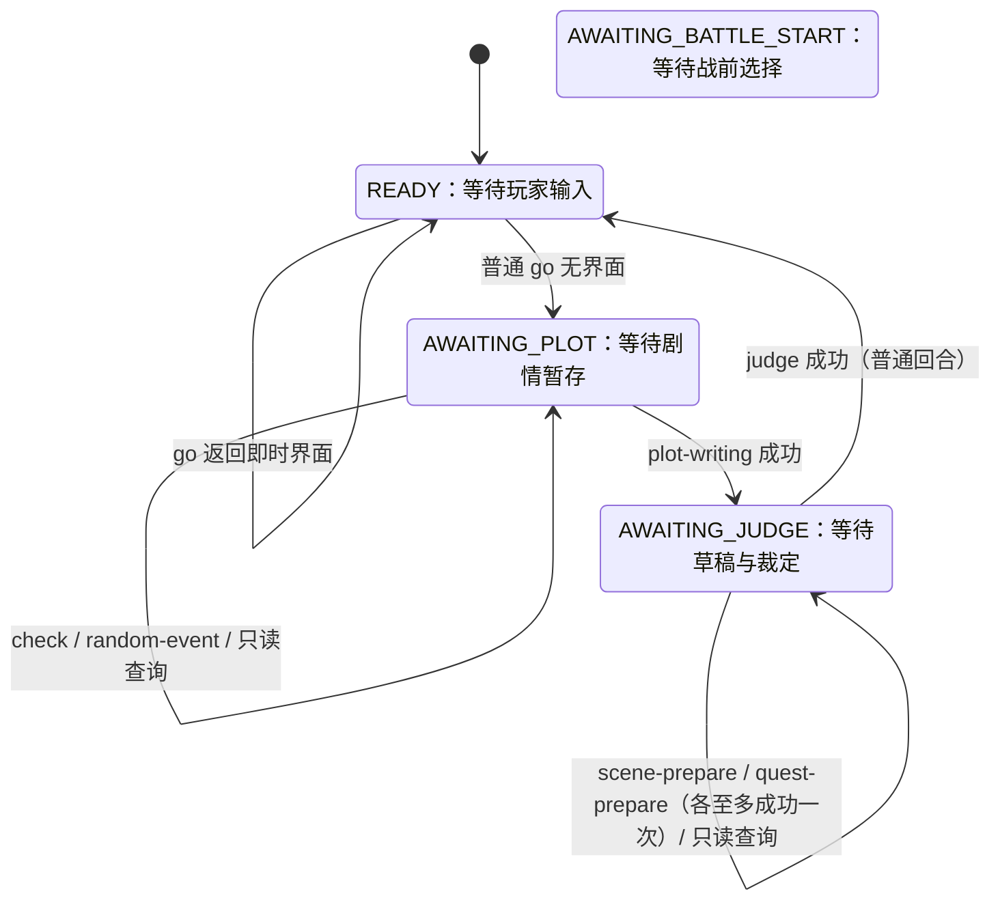

# 核心引擎

`scripts/` 是武侠 RPG 的确定性规则与状态引擎。它接收结构化 JSON，完成数据查询、行为结算、判定、战斗推进和存档读写，再返回结构化 JSON 供 GM、Web 或 DSH 前端使用。

引擎负责：

- 校验行为与状态变化；
- 计算资源、时间、属性、战斗和随机结果；
- 维护角色、世界、战斗与存档状态；
- 组装界面所需的结构化数据。

引擎不负责：

- 理解玩家的自然语言；
- 决定剧情如何发展；
- 替 GM 撰写剧情叙事；
- 直接渲染浏览器控件。

## 1. 运行要求

- Python 3.9 或更高版本；
- 仅使用 Python 标准库，无需安装 pip 依赖；
- 默认存档目录为 `~/.wuxia/save/`；
- 可通过 `WUXIA_RPG_SAVE_DIR` 指定其他存档目录。

建议从 `wuxia-rpg/` 目录运行命令：

```bash
python3 scripts/engine.py
```

不带子命令时会打印 CLI 概览。

## 2. 统一 CLI 协议

主入口是 `engine.py`：

```bash
python3 scripts/engine.py <command>
```

每次调用从 stdin 读取一个 JSON 值，并向 stdout 输出 JSON。JSON 解析失败或参数不合法时，CLI 通常以状态码 `2` 退出；部分用法错误会写入 stderr。

### 命令一览

| 命令 | 定位 | 主要输入 |
|---|---|---|
| `go` | 预结算玩家主动行为；普通无界面回合结果尚未提交 | `槽位`、`行为` |
| `plot-writing` | 暂存普通叙事及一般状态变更 | `槽位`、`行为`、`当前剧情`、`场景要素`、`提及地点`、`经历概括` |
| `judge` | 采用暂存剧情、草稿及 go 结果并统一提交 | `槽位` |
| `check` | 执行属性或技艺判定 | `槽位`、`属性`、`判定角色`、`对抗`、`基础成功率` |
| `random-event` | 判断随机事件是否触发 | `槽位`、`基础成功率` |
| `scene-prepare` | 批量预校验场景登记、隔离或重连 | `槽位`、`场景`批次数组 |
| `quest-prepare` | 批量预校验即兴任务创建或扩展蓝图 | `槽位`、`任务`批次数组 |
| `query` | 查询角色、武学、物品、状态、阵营或场景角色 | `槽位`、`类型`，以及可选查询条件 |
| `setting` | 聚合查询人物或门派设定 | `槽位`、`目标` |
| `recommend` | 推荐武学、心法和装备 | `槽位`、`一级属性`、`武学偏好`等 |
| `map-query` | 查询区域场景图 | `槽位`、`区域` |

完整行为参数以 [`../references/wuxia-rpg-actions.md`](../references/wuxia-rpg-actions.md) 为准，数据字段以 [`../references/wuxia-rpg-data-schema.md`](../references/wuxia-rpg-data-schema.md) 为准。

### 示例：玩家行为

```bash
python3 scripts/engine.py go <<'JSON'
{
  "槽位": 1,
  "行为": [
    {"类型": "查看线索"}
  ]
}
JSON
```

`行为`可以是一个数组。普通无界面回合的 go 结果是暂定结算，直到 judge 成功才成为权威状态；有界面时按即时界面流程处理。

### 示例：普通叙事与裁定

```bash
python3 scripts/engine.py plot-writing <<'JSON'
{
  "槽位": 1,
  "行为": [],
  "当前剧情": "沈听雪推开木门，屋内只余一盏将熄的油灯。",
  "场景要素": [
    {"主体": "油灯", "描写": "灯芯发黑，灯油将尽"}
  ],
  "提及地点": []
}
JSON
python3 scripts/engine.py judge <<'JSON'
{"槽位":1}
JSON
```

普通 `plot-writing` 接受 `槽位`、`行为`、`当前剧情`（必填）、`场景要素`（必填非空）、`提及地点`（必填，可空）和可选 `经历概括`。角色、线索、时间、关系度等变化放入 `行为`。普通 `judge` 只接受 `槽位`，不重复接收剧情与行为；建号开场同样走此流程，战斗专用步骤另行处理。

### 示例：判定

```bash
python3 scripts/engine.py check <<'JSON'
{
  "槽位": 1,
  "属性": ["身法"],
  "判定角色": ["沈听雪"],
  "对抗": "@8",
  "基础成功率": 50
}
JSON
```

`check` 对外返回成功或失败及叙事提示，不暴露成功率和掷骰点数。有效判定会写入当前槽位的短期判定留痕，供后续 `judge` 检查叙事是否采用了判定结果。

### 示例：准备地图变化

```bash
python3 scripts/engine.py scene-prepare <<'JSON'
{"槽位":1,"场景":[{"操作":"登记","区域":"苏州","场景":"废园","方位出口":{"东":"平江路"}}]}
JSON
```

plot-writing 成功后可准备一次非空场景批次；校验成功即锁定，由同轮只传 `槽位` 的 judge 整批自动采用。prepare 不改正式地图或轮次。

### 示例：准备即兴任务

```bash
python3 scripts/engine.py quest-prepare <<'JSON'
{"槽位":1,"任务":[{"操作":"创建","蓝图":{"名称":"示例线索","起始节点":["end"],"节点":[{"节点ID":"end","完成条件":{},"完成摘要":"线索已了。","关闭条件":null,"关闭描述":null,"终局":"关闭"}]}}]}
JSON
```

plot-writing 成功后可准备一次线索批次；校验成功即锁定，由同轮只传 `槽位` 的 judge 按批次顺序全部采用。prepare 不改正式任务、事实、奖励或轮次。

### 示例：基础数据查询

未建档时可用槽位 `0` 查询冻结基线数据：

```bash
python3 scripts/engine.py query <<'JSON'
{
  "槽位": 0,
  "类型": "武学",
  "名称": "太乙玄门剑",
  "等级": 1
}
JSON
```

## 3. 普通回合 `go` → `plot-writing` → `judge` 协议

```text
玩家输入 → go 暂定机制结果 → 可选 check / random-event → plot-writing（一次）
         → 可选 scene-prepare / quest-prepare（各一次）→ judge(槽位，自动采用全部草稿) → 渲染
```

有界面的即时操作直接渲染；管理与战斗特殊路径保持独立，不套用普通回合链路。

### 回合状态机

正式槽位将状态持久化到 `.runtime/turn_state.json`；校验失败或被门禁拒绝时停留在可修正的阶段。



plot-writing 与两个 prepare 各自首次成功后锁定；建议先准备场景再准备线索，所有草稿由 judge 自动采用。校验失败只修正当前阶段，不重跑 go；异常中断由宿主使用内部恢复能力处理。战斗触发、开始和推进及建号另有阶段与门禁；读档成功清理本轮短期状态，`slot=0` 门厅不持久化普通回合状态。

### `go`

`go`只承载玩家主动行为，例如移动、休息、交易、使用物品、配置、查询、存档和战斗操作。

- 普通无界面行为的确定性成本和直接效果只写入待提交投影；同批失败不保留这些改动；
- `go` 不推进世界交互轮次，也不触发自动存档；
- 返回 `界面` 时直接渲染，按界面专用流程提交；无 `界面` 时按需判定，再经 `plot-writing` 拟议剧情和状态变更。

### `judge`

普通叙事的 `judge` 只传槽位：按场景、任务、一般状态变更的顺序采用本轮全部草稿，一次发布整个回合；失败保留已锁定草稿。只有成功返回 `exploration-ui` 才推进交互轮次。战斗开始与推进走专用流程，不推进大世界轮次。

### 场景草稿与 `scene-prepare`

`scene-prepare` 在 plot-writing 成功后按需调用。`场景`为非空数组，可批量登记、隔离或重连地点；首次成功后写入并锁定 `.runtime/scene_drafts.json`。`judge` 自动整批采用，不接收 GM 提交的 `场景-采用草稿`、`登记场景` 或 `隔离地点`。prepare 失败不写草稿，judge 失败保留草稿，judge 成功或读档后清理。

### 预设故事线与 `quest-prepare`

新档会按文件名排序载入 `assets/data/quests/*.json`，一个文件对应一个任务，全部以隐藏线索创建。起始节点条件满足时只返回 GM 入口提示；GM 在剧情中实际呈现引子后再用 `线索-发现` 公开。预设目录不使用索引或子目录，任一文件无效都会使建档失败并清理半成品槽位。

`quest-prepare` 在 plot-writing 成功后按需准备运行时线索草稿，`任务`数组可批量创建、扩展、修改或关闭；首次成功后写入并锁定 `.runtime/quest_drafts.json` 的本轮批次。judge 按 `order` 自动采用全部任务。prepare 失败不写批次，judge 失败保留批次，judge 成功或读档后清理。

### 事务边界

普通叙事回合的 `go`、判定、`plot-writing` 和准备步骤只修改待提交工作区；`judge` 在独立试算代完成结算后，原子切换活动存档代指针，一次发布整个回合。阶段校验失败可原地修正，成功后锁定；judge 失败保留全部草稿及已掷结果。异常放弃由宿主调用内部恢复能力。即时界面和战斗操作走各自的专用提交路径。

结算内部共用 `SettlementSession` 和 `MutationExecutor`：状态修改先在暂存区应用，再根据实际 before/after 生成领域事件，并同步执行 trigger 产生的后续 mutation/event，归约稳定后统一提交。事件队列只存在于本次调用的内存中，不写入存档，也不用于 Event Sourcing。

线索公开 notice 只在提交成功后生成：首次公开为 `线索【名称】已发现`，后续有效进展、路径关闭或扩展为 `线索【名称】已更新`。同一结算内按任务去重，发现优先；完成摘要、关闭描述和奖励描述保留在 `任务摘要及进度` 投影中，内部事件与 GM 提示不混入玩家 notice。任务归约会按 `all/any` 传播阻断状态；无剩余路径时自动关闭线索。

普通回合发布前的校验、trigger 或进程失败不会改变活动存档代；发布后可读取已保存的最终响应。

## 4. 返回数据与界面路由

引擎返回普通 JSON 对象。常见字段包括：

| 字段 | 含义 |
|---|---|
| `界面` | 前端或 GM 应进入的界面类型 |
| `渲染模式` | 归一渲染模式：dsh / WEB_UI / LLM（未设置按 LLM） |
| `渲染文本` | 完整界面 Markdown（仅 LLM 渲染模式返回）；有则原样输出，无（dsh/WEB_UI）则直接输出当前剧情 |
| `结算` | 本次成功或失败的结算条目 |
| `剧情描写` | 已写入的当前剧情 |
| `场景要素` | 当前可见对象及可用特殊指令 |
| `当前状态` | 队伍、位置、时间、体力、金钱等界面状态 |
| `槽位` | 当前存档槽位 |
| `saved` | 本轮是否产生自动存档 |
| `剩余` | 距下一次自动存档的交互轮数 |
| `错误` | 参数、规则或状态校验错误 |

`界面`是路由标识。LLM 渲染模式下 engine 把完整 Markdown 拼入顶层 `渲染文本`（模板位于 `settle/markdown_ui.py`）：GM 有 `渲染文本` 时严格原样输出，不改写或润色，包括空字符串。dsh/WEB_UI 模式只返回结构化字段供前端渲染卡片，不生成 `渲染文本`，GM 直接输出当前剧情。`title-ui` 的创建草稿随 action 无状态往返；`battle-ui` / `battle-end-ui` 的规范战报来自 `battle.py`。judge 自检失败返回的 `exploration-ui`+`错误` 不生成 `渲染文本`，须修正后重调。

## 5. 目录结构

```text
scripts/
├── engine.py                 # go/plot-writing/prepare/judge/query 与内部恢复 CLI 入口
├── settle/                   # 大世界结算编排、事务、字段和 UI 数据
├── common/                   # DAO、判定、状态、特效加载、时间工具
├── world/                    # 场景、地图、角色、交易、配装、武学与事件
├── combat/                   # 战斗状态机、ATB、AI、技能评分与战报
├── store/                    # explore、交换文件、快照和槽位持久化
├── effects/                  # 技能、状态、装备和物品动态脚本
└── tests/                    # 单元测试、契约测试与端到端测试
```

### `settle/`

| 模块 | 职责 |
|---|---|
| `engine_actions.py` | go adapter、mutation handler、状态快照与事件投影 |
| `engine_fields.py` | go/judge 共用的字段修改原语 |
| `mutation_executor.py` | 按类型注册并执行 mutation 的统一入口 |
| `domain_events.py` | 不可变领域事件、事件工厂、类型常量与 V1 codec |
| `settlement.py` | 一次 go/judge 的暂存、事件 FIFO、trigger 归约和提交生命周期 |
| `triggers.py` | 精确类型/命名空间订阅与标准 trigger 输出 |
| `world_facts.py` | 槽位级规范事实定义、类型、互斥、写入与显式修订 |
| `quest_models.py` | 任务蓝图、运行态与旧线索迁移 |
| `quest_conditions.py` | 受限条件 DSL 的校验、求值与引用提取 |
| `quest_validator.py` | 图结构、事实定义与扩展历史校验 |
| `quest_engine.py` | 线索创建、发现、扩展、完成/关闭/阻断固定点归约与奖励生成 |
| `quest_projection.py` | 权威任务状态到玩家线索栏和提交后统一提示的投影 |
| `quest_triggers.py` | 机械事件到规范事实、事实到相关任务归约的触发器 |
| `engine_io.py` | 槽位切换、角色/商人暂存读写、状态组装、战斗临时文件管理 |
| `engine_ui.py` | 结构化界面响应与公共字段 |
| `title_flow.py` | 标题创建草稿、校验、随机分配与初始角色组装 |
| `engine_state.py` | 角色、场景和商人缓存的兼容暂存引用 |

### `common/`

| 模块 | 职责 |
|---|---|
| `dao.py` | 基线数据与槽位覆盖层的统一查询、派生和写入 |
| `check.py` | 属性判定与随机事件 |
| `status_manager.py` | 战斗和大世界共用的状态生命周期 |
| `effect_loader.py` | 动态加载技能、状态、物品和装备脚本 |
| `time_utils.py` | 世界时间换算与显示 |

### `world/`

| 模块 | 职责 |
|---|---|
| `scene.py` | 区域内场景图、场景人物和功能场景 |
| `map.py` / `map_query.py` | 跨区域地图与场景图查询 |
| `character_ops.py` | 角色字段变化、关系、死亡等操作 |
| `loadout.py` | 装备、主动武学、心法和战斗物品配置 |
| `mastery.py` | 武学精进与十境增益 |
| `trade.py` | 商人库存、买卖和价格结算 |
| `event.py` | 线索与事件视图 |

### `combat/`

- `battle_engine.py`：战斗状态机、ATB、命中、暴击、伤害、治疗、状态钩子和经验；
- `battle.py`：战斗 CLI、战斗运行时文件和战报组装；
- `ai_styles.py`：平衡、勇猛、谨慎等 AI 风格；
- `skill_scorer.py`：AI 候选行动评分。

正常集成应通过 `engine.py go/judge` 驱动战斗。`battle.py` 主要用于引擎内部调用和独立调试。

### `store/`

- `save_manager.py`：槽位、快照、自动存档和恢复；
- `explore_store.py`：`explore.json` 的收敛读写接口；
- `tips.py`：`go` 向 `judge` 传递机制变化摘要；
- `check_log.py`：短期判定留痕；
- `quest_drafts.py`：即兴任务 prepare 与同轮 judge 之间的非权威草稿；
- `battle_last.py`：战斗操作与下一次 `judge` 之间的结算底稿；
- `events_store.py`：探索事件列表的数据入口。

## 6. 数据与持久化

### 基线数据

只读基线位于：

```text
wuxia-rpg/assets/data/
```

主要包含：

- `characters/`
- `skills/`
- `items/`
- `buffs/`
- `factions/`
- 地图、世界观和 NPC 初始位置等公共 JSON

发布包可以只提供 `assets/data.zip`。创建角色时，如果 `assets/data/` 不存在而压缩包存在，引擎会先还原基线目录。

### 槽位写时复制

每个正式角色使用独立槽位：

```text
<WUXIA_RPG_SAVE_DIR>/slot_<N>/
├── .data/                    # 被修改或新建的数据条目
├── .runtime/                 # 回合、战斗与即兴任务草稿等短期状态
├── meta.json                 # 角色名、创建时间、最近存档等元信息
├── explore.json              # 当前世界与叙事状态
├── merchant.json             # 当前商人货架缓存
├── map_overlay.json          # 运行时新增或改写的场景连接
├── scene_types_overlay.json  # 运行时功能场景类型
├── world_facts.json          # 规范世界事实定义与当前记录
├── quest_state.json          # 任务蓝图、节点历史、奖励领取与生命周期
└── savefile_*.json           # 快照（含上述事实与任务状态）
```

DAO 读取时先查当前槽位的 `.data/`，未命中再回退到 `assets/data/`。写入只进入 `.data/`，不会修改基线。因此：

- 建档无需复制全部数据；
- 不同槽位可以共享同一套只读基线；
- 角色和世界修改彼此隔离；
- 快照只需保存相对基线的字段级差异。

不要在运行时直接修改 `assets/data/`，也不要绕过 DAO 修改 `.data/`。

JSON 文件存在但发生 IO、编码、语法或结构错误时会返回分类错误并停止权威状态写入；仅索引、商人缓存和短期交换文件会记录告警后按既定策略降级。

### `explore.json`

`explore.json` 是当前槽位的实时世界镜像，保存：

- 当前位置与当前时间；
- 体力和队伍；
- 当前剧情与场景要素；
- 经历概括；
- 玩家可见线索及其进展投影（权威任务状态在 `quest_state.json`）；
- 状态提示；
- 世界交互轮次 `round`。

角色气血、内力、铜钱、经验、物品、装备和武学等角色数据由 `.data/` 中的角色覆盖文件维护，不应重复塞入 `explore.json`。

### 短期交换文件

槽位中还可能出现：

| 文件 | 生命周期 |
|---|---|
| `tips.json` | `go` 成功后写入；`judge` 成功消费后清除 |
| `check.json` | 保存最近若干轮判定留痕；读档时清除 |
| `.runtime/quest_drafts.json` | 保存当前 round 最新成功任务批次，以任务 ID 为键；judge 成功或读档后清除 |
| `battle_last.json` | 保存最近一次战斗操作底稿；战后清除 |

这些文件是跨 CLI 进程传递上下文的交换介质，不是长期游戏状态，也不应由调用方手工编辑。

战斗状态、元数据和战报位于 `slot_<N>/.runtime/battle/`，不随存档快照保存；无 slot 调试时使用 `WUXIA_RPG_RUNTIME_DIR/battle/` 或系统临时目录。

### 快照与自动存档

- 每个槽位最多保留 5 个快照；
- 超出上限时淘汰最早的快照；
- 建号后的首个探索回合创建“初入江湖”快照；
- 此后每 5 个成功的 `exploration-ui` 交互轮触发自动存档；
- 读档会根据冻结基线和快照差异重建 `.data/`，并同步探索、地图与商人状态。

## 7. 战斗与动态特效

战斗引擎维护：

- 参战者、队伍和操控方式；
- 充能、速度和行动顺序；
- 气血、内力、冷却和物品次数；
- 状态持续时间与钩子；
- AI 候选动作评分；
- 战局结果、经验结算和战报数据。

动态脚本目录：

```text
effects/
├── skills/       # 武学特效
├── status/       # 状态钩子
├── equipments/   # 装备特效
└── items/        # 物品特效
```

特效由 `common/effect_loader.py` 按名称加载并在进程内缓存。特效脚本可以修改战斗事件上下文或当前战斗内存状态，但必须服从战斗引擎生命周期：

- 不得自行写槽位文件；
- 不得绕过状态管理器伪造持久状态；
- 不得依赖已废弃的旧钩子名；
- 新增或修改钩子后必须补充契约测试。

独立查看角色派生战斗属性：

```bash
python3 scripts/combat/battle.py stats 骆逸
```

用固定随机种子调试 AI 战斗：

```bash
python3 scripts/combat/battle.py \
  --seed 7 \
  --允许逃跑 false \
  --teams '甲:陈挺之;乙:和悦' \
  陈挺之 和悦
```

参战角色必须存在于当前数据源中，队伍必须通过 `--teams` 明确指定。

## 8. 集成方式与并发约束

### CLI 子进程

Coding Agent 通常为每次调用启动一个 `engine.py` 子进程。stdin/stdout 是稳定边界，短期上下文通过槽位交换文件衔接。

### Python 模块

长驻服务也可以把 `scripts/` 加入模块搜索路径后导入：

```python
from pathlib import Path
import sys

sys.path.insert(0, str(Path("wuxia-rpg/scripts").resolve()))
import engine

result = engine.go(1, [{"类型": "查看线索"}])
```

但引擎内部包含进程级可变状态：

- DAO 当前数据目录及缓存；
- `settle.engine_state` 事务暂存区；
- 战斗运行时全局和临时文件。

因此，长驻进程必须使用一把覆盖全部槽位的全局锁串行调用引擎，不能只做“每槽位一把锁”。`engine_gateway.py` 统一持有该锁，`engine_service.py` 只处理 HTTP 与生命周期。

十个公开 operation 定义在 Skill 根目录的 `tools.json`，Web 与 DSH 均从 `/api/tools` 注册宿主工具。两者共用服务实现，但默认启动独立进程。多个进程同时写同一存档根目录仍可能发生竞争，应使用不同的 `WUXIA_RPG_SAVE_DIR`，或由更高层确保互斥。

### 渲染模式

`WUXIA_RPG_RENDER_MODULE` 会写入返回对象的 `渲染模式` 字段，供宿主选择文本或结构化展示。它不改变规则结算本身。

## 9. 扩展引擎

### 新增 `go` 行为

1. 在 `settle/engine_actions.py` 实现 action adapter；
2. 将状态效果表示为已注册 mutation，经 `MutationExecutor` 执行；
3. 明确体力、时间、事务和界面语义；
4. 更新 `references/wuxia-rpg-actions.md`；
5. 添加成功、失败和批次回滚测试。

行为处理器不得直接写角色、探索状态或商人缓存。复合行为可复用既有结算原语，但只能从注册的 mutation handler 进入。

### 新增 `judge` 状态变化

1. 在 `settle/engine_fields.py` 增加可复用字段原语，或在 `engine_actions.py` 增加专用 mutation handler；
2. 在 `build_mutation_executor()` 注册 apply、snapshot 和 project；
3. project 必须依据真实 before/after 生成事件，无实际变化时不发机械事件；
4. 明确同批失败时的回滚行为，并更新行为契约和测试。

会影响任务条件的语义结果一律使用已注册 `事实`，不得直接指定任务阶段。

### 新增 trigger

1. 在 `TriggerRegistry` 按精确事件类型或命名空间注册；
2. handler 只读取不可变 `DomainEvent`，返回 `TriggerOutcome`；
3. 后续状态变化必须作为 mutation 返回，后续事件必须使用 `EventRequest`；
4. trigger 不直接调用 DAO 或写盘，并须覆盖固定点和循环上限测试。

事件 envelope 的增删和版本兼容集中在 `EventCodecV1`；业务 handler 不依赖序列化字典布局。

### 新增数据条目

- 按现有 JSON schema 和目录分组添加；
- 角色、武学、物品等分组数据需保持对应 `index.json` 一致；
- 动态效果名必须与 `effects/` 下的脚本文件名一致；
- 不要把运行时角色或测试变更写回基线。

### 新增特效

1. 选择 `skills/`、`status/`、`equipments/` 或 `items/`；
2. 复用现有同类脚本的当前钩子签名；
3. 通过状态管理器处理持续状态；
4. 为事件上下文修改、层数、持续时间和清理路径添加测试。

## 10. 测试与调试

运行完整回归：

```bash
python3 scripts/tests/run_all_tests.py
```

该入口依次执行：

1. Python 源码编译；
2. `unittest` 与端到端测试；
3. `assets/data/` 全量 JSON 解析；
4. 废弃战斗钩子残留检查。

仅检查主入口语法：

```bash
python3 -m py_compile scripts/engine.py
```

调试引擎调用时应使用隔离存档目录：

```bash
WUXIA_RPG_SAVE_DIR=/tmp/wuxia-engine-test \
python3 scripts/engine.py go <<'JSON'
{"槽位": 1, "行为": [{"类型": "开始游戏"}]}
JSON
```

排查问题时优先检查：

1. CLI 的退出码、stdout JSON 和 stderr；
2. 返回中的 `错误`、`结算`和`界面`；
3. 对应槽位的 `explore.json` 与 `.data/`；
4. `tips.json`、`check.json`、`battle_last.json` 是否符合当前阶段；
5. 对应 slot 的 `.runtime/battle/` 中战斗状态与战报；
6. 是否存在并发调用或错误的 `WUXIA_RPG_SAVE_DIR`。

## 11. 相关文档

- [`../SKILL.md`](../SKILL.md)：GM 主循环与工具调用规则；
- [`../references/wuxia-rpg-actions.md`](../references/wuxia-rpg-actions.md)：行为和状态变化参数契约；
- [`../references/wuxia-rpg-data-schema.md`](../references/wuxia-rpg-data-schema.md)：数据结构；
- [`../references/wuxia-rpg-battle-system.md`](../references/wuxia-rpg-battle-system.md)：战斗系统；
- [`../references/ui/`](../references/ui/)：界面交互规则（正文模板见 `settle/markdown_ui.py`）；
- [`../../docs/技术手册.md`](../../docs/技术手册.md)：完整项目架构与设计取舍。
